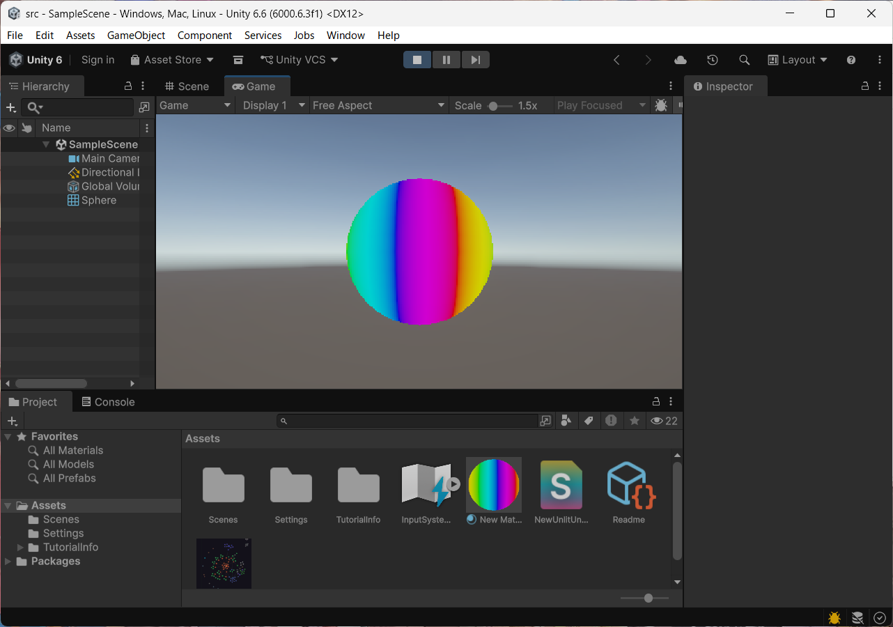
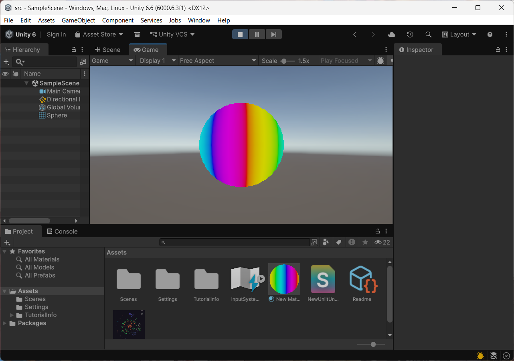

# はじめに
プログラムワークショップⅣの第2回の管理用です

# 結果画像

- 工夫した点：法線のx成分から色相を決めて、時間(_Time)でずらすことで、虹色のグラデーションが球の上を流れ続けるようにした。速さはマテリアルの Rainbow Speed で変えられる。

# 進め方

- 本リポジトリをforkしてください。
- fork先のリポジトリを更新してください
- Unityのプロジェクトをsrc内で進めて下さい。
- 結果を画面キャプチャして、画像としてリポジトリに追加して、上記のリンクから見れるようにしてください。
- 完成したら本リポジトリのmainブランチにpull requestを投げてください

